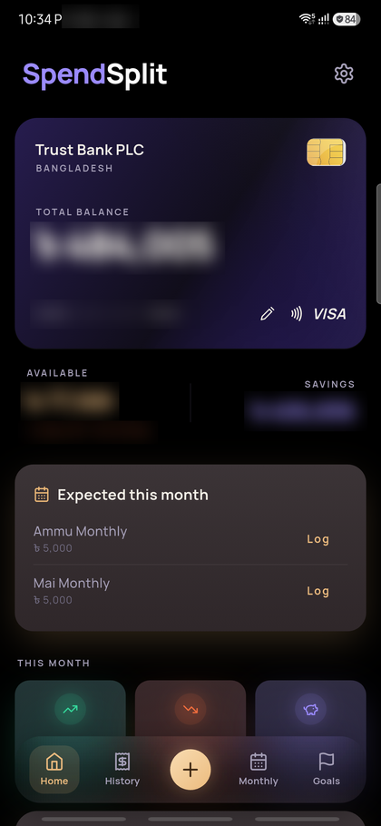
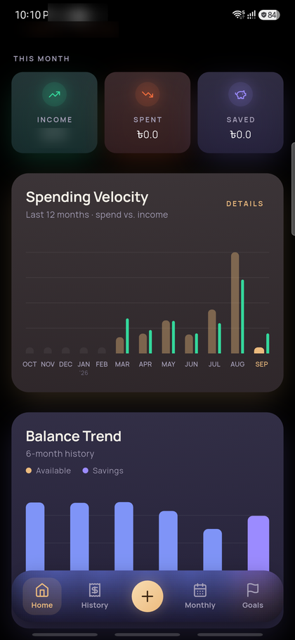
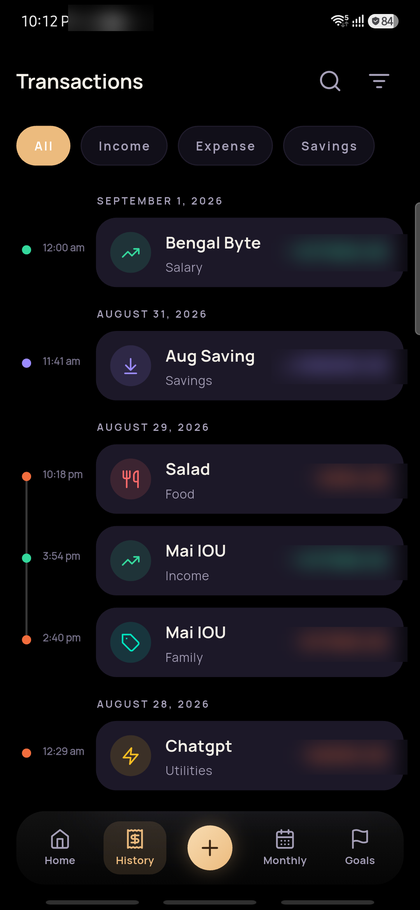
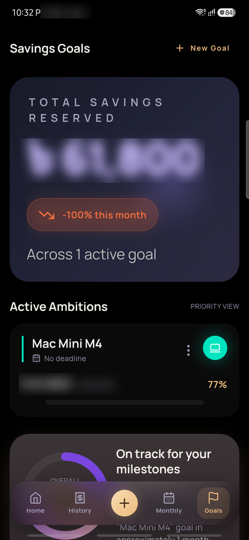
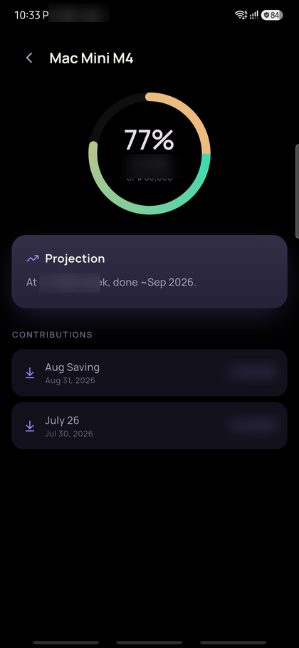
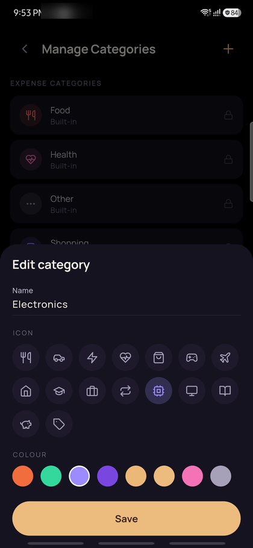
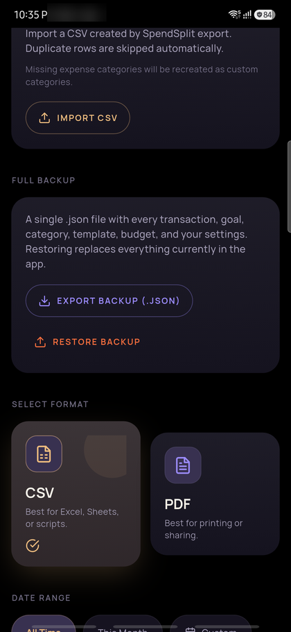

# SpendSplit

A minimalist, **offline-only** mobile expense tracker built with Flutter. It splits a
single bank-account balance into **Available** (spendable) and **Savings**, wrapped in a
pure-black glassmorphic UI, biometric lock, and an isolated USD spending tracker.

> Android-first, iOS compatible. No cloud, no accounts, no sync — all data lives on the
> device (SQLite) with sensitive settings in the platform keystore.

---

## Screens

| Dashboard | Trends | History |
|---|---|---|
|  |  |  |

| Savings goals | Goal detail & projection | Category editor |
|---|---|---|
|  |  |  |

| Full JSON backup |
|---|
|  |

<sub>Monetary figures in the screenshots are blurred; the data shown is demo data.</sub>

---

## Features

- **Split balance** — one bank balance, tracked as Available + Savings; every figure
  (Total, Available, Savings, Dollar Remaining) is derived, never stored.
- **Runway** — how many days Available lasts at the trailing-30-day burn rate.
- **Balance Trend** — 6-month reconstructed Available / Savings stacked-bar history.
- **Spending Velocity** — rolling 12-month expense bars with an income overlay.
- **Category budgets** — optional per-category monthly limits, edited inline on the
  Monthly screen with a progress bar.
- **Category editor** — rename / re-icon / recolour custom categories; the six
  predefined categories stay locked.
- **Savings goals** — progress rings, priority ordering, and per-goal contributions
  that post a linked deposit and bump the goal.
- **Goal detail** — contribution history plus a completion projection from your
  contribution cadence (and a required-weekly figure when a goal has a deadline).
- **Templates** — save any transaction as a template; the three most-used surface as
  quick chips, and templates flagged *Expected monthly* that haven't been logged this
  month appear on the dashboard.
- **Dollar tracker** — a fully isolated USD ledger with an annual limit, utilization
  ring, and year-end pace projection. No currency conversion, no BDT cross-contamination.
- **Month-end recap** — a dismissible dashboard card (days 1–5) summarising the prior
  month: net saved, savings rate, top categories, budget result.
- **CSV / PDF export**, **CSV import**, **full JSON snapshot backup & restore**
  (hold-to-confirm), and an Android home-screen widget.
- **Biometric lock** with re-lock on background.

---

## Tech stack

| Concern | Choice |
|---|---|
| State | Riverpod |
| Database | Drift (SQLite), schema v7, additive migrations |
| Navigation | GoRouter (ShellRoute + pushed routes) |
| Charts | fl_chart |
| Typography | Google Fonts — Manrope |
| Auth | local_auth |
| Files | file_selector, share_plus, path_provider |
| Design | "Luminous Depth" — OLED black `#000000`, frosted-glass nav pill, no card borders |

Architecture is feature-first with MVVM: pure-Dart calculators in `FinanceCalculators`
(unit-tested), exposed through Riverpod providers, consumed by thin widgets.

```
lib/
├── core/        theme, constants, utils, shared widgets
├── data/        database (tables, daos), models, repositories
├── features/    auth · dashboard · transactions · monthly · goals · dollar_tracker · export · settings
└── providers/   global Riverpod providers
```

---

## Build & run

```bash
flutter pub get
dart run build_runner build --delete-conflicting-outputs   # Drift codegen
flutter run
```

Tests: `flutter test` (calculator regressions, schema migrations, snapshot round-trip,
widget layout guards).
